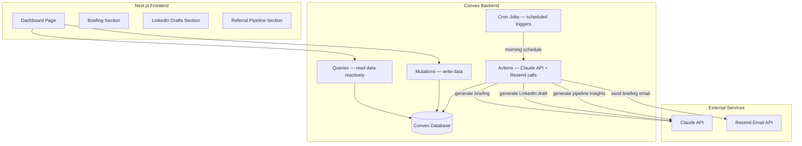
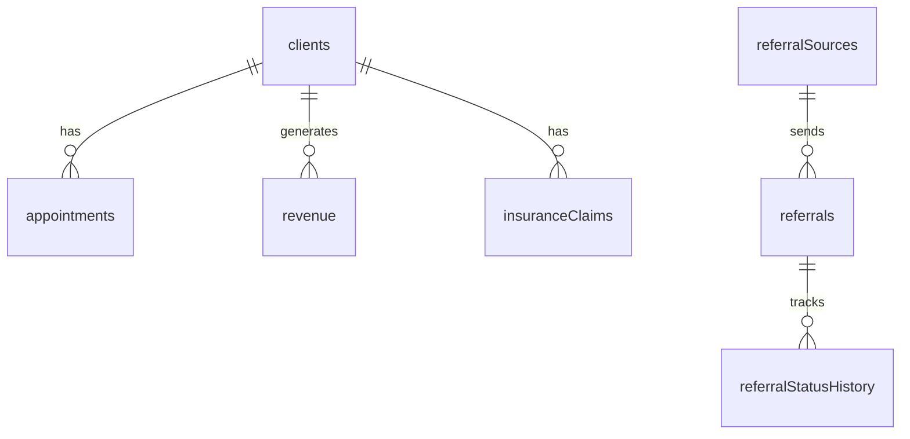

# Meridian BH Automation Suite — Technical Plan

## Tech Stack

| Layer | Choice | Rationale |
|-------|--------|-----------|
| Language | TypeScript | Full-stack type safety, Convex native support |
| Frontend | Next.js 14 (App Router) | User knows it, SSR for fast load, pairs with Convex |
| Backend | Convex | User's primary backend — real-time reactivity, cron jobs, HTTP actions, Node actions all built-in. No separate server needed |
| Database | Convex (built-in) | Schema-defined document store with real-time subscriptions. Already in user's stack |
| AI | Claude API (@anthropic-ai/sdk) | Client requirement — used for briefing generation, LinkedIn drafting, pipeline insights |
| Email | Resend (@resend/node) | Simple transactional email API, generous free tier, clean DX |
| Styling | Tailwind CSS + shadcn/ui | Fast to build polished UI, demo-video ready without custom design work |
| Package Manager | npm | Standard, no opinion needed |

### Alternatives Considered
- **Google Sheets/Airtable for data**: Not chosen — creates immediate limitations, looks like a prototype not a product
- **Supabase for backend**: Not chosen — user prefers Convex, already has deep experience with it
- **n8n/Make.com for orchestration**: Not chosen — Convex cron jobs + Node actions handle all scheduling natively. Adding a workflow tool adds complexity with no benefit for the demo

## System Architecture



### Component Responsibilities

| Component | Responsibility | Boundary |
|-----------|---------------|----------|
| Next.js App | Render dashboard UI, handle user interactions | Does NOT call external APIs directly — all through Convex |
| Convex Queries | Read data reactively for dashboard display | Read-only, no side effects |
| Convex Mutations | Write data (status updates, draft approvals, etc.) | Deterministic, no external calls |
| Convex Actions | Call Claude API and Resend, then write results via mutations | Only place external APIs are called |
| Convex Cron Jobs | Trigger scheduled actions (morning briefing) | Only scheduling — delegates to actions |
| Claude API | Generate natural language content (briefings, drafts, insights) | Stateless — no data storage |
| Resend | Deliver emails | Stateless — fire and forget with delivery status |

## Data Models

All models use Convex's built-in `_id` and `_creationTime` fields.

### clients
| Field | Type | Constraints | Description |
|-------|------|-------------|-------------|
| name | string | required | Client full name (fake) |
| status | string | "active" \| "inactive" \| "discharged" | Current enrollment status |
| location | string | required | Practice location ("Main Campus" or "East Clinic") |
| payerType | string | "insurance" \| "self_pay" | Payment method |
| insuranceProvider | string | optional | Insurance company name (null if self-pay) |
| admitDate | number | required | Timestamp of admission |

### appointments
| Field | Type | Constraints | Description |
|-------|------|-------------|-------------|
| clientId | id("clients") | required, FK | Reference to client |
| date | number | required | Appointment timestamp |
| status | string | "scheduled" \| "completed" \| "no_show" \| "cancelled" | Appointment outcome |
| location | string | required | Practice location |
| provider | string | required | Clinician name |

### revenue
| Field | Type | Constraints | Description |
|-------|------|-------------|-------------|
| date | number | required | Date of revenue entry |
| amount | number | required | Dollar amount (cents as integer) |
| type | string | "insurance_payment" \| "self_pay" \| "copay" | Revenue category |
| clientId | id("clients") | required, FK | Reference to client |
| claimId | id("insuranceClaims") | optional, FK | Associated claim if insurance |

### insuranceClaims
| Field | Type | Constraints | Description |
|-------|------|-------------|-------------|
| clientId | id("clients") | required, FK | Reference to client |
| insuranceProvider | string | required | Payer name |
| amount | number | required | Claim amount in cents |
| dateSubmitted | number | required | When claim was filed |
| datePaid | number | optional | When payment received (null = unpaid) |
| status | string | "submitted" \| "pending" \| "paid" \| "denied" | Claim status |

### referralSources
| Field | Type | Constraints | Description |
|-------|------|-------------|-------------|
| name | string | required | Source name (e.g., "Dr. Sarah Chen") |
| organization | string | required | Organization name (e.g., "Valley Primary Care") |
| type | string | "pcp" \| "er" \| "social_worker" \| "school_counselor" \| "therapist" \| "other" | Source category |
| phone | string | optional | Contact phone |
| email | string | optional | Contact email |
| lastReferralDate | number | optional | Timestamp of most recent referral |

### referrals
| Field | Type | Constraints | Description |
|-------|------|-------------|-------------|
| sourceId | id("referralSources") | required, FK | Who referred |
| patientName | string | required | Referred patient name (fake) |
| dateReceived | number | required | When referral came in |
| currentStatus | string | "received" \| "contacted" \| "scheduled" \| "admitted" \| "lost" | Current pipeline status |
| lostReason | string | optional | If lost: "no_show" \| "insurance_issue" \| "went_elsewhere" \| "other" |
| notes | string | optional | Free text notes |

### referralStatusHistory
| Field | Type | Constraints | Description |
|-------|------|-------------|-------------|
| referralId | id("referrals") | required, FK | Reference to referral |
| status | string | required | Status at this point |
| changedAt | number | required | Timestamp of change |

### linkedinDrafts
| Field | Type | Constraints | Description |
|-------|------|-------------|-------------|
| topic | string | required | Input topic from user |
| content | string | required | Generated post content |
| status | string | "draft" \| "approved" \| "rejected" | Review status |
| generatedAt | number | required | When Claude generated it |
| reviewedAt | number | optional | When user reviewed it |

### briefings
| Field | Type | Constraints | Description |
|-------|------|-------------|-------------|
| date | number | required | Briefing date |
| content | string | required | Full briefing text (Claude-generated) |
| metrics | object | required | Raw metrics snapshot (JSON: activeClients, noShows, revenue, agingClaims) |
| emailSent | boolean | required | Whether email delivery succeeded |
| emailId | string | optional | Resend message ID for tracking |

### Relationships


### Indexes
| Table | Index | Fields | Purpose |
|-------|-------|--------|---------|
| appointments | by_date | date | Query appointments by date range for no-show tracking |
| appointments | by_client | clientId | Lookup appointments per client |
| revenue | by_date | date | Revenue aggregation by date range |
| insuranceClaims | by_status | status | Filter aging claims |
| referrals | by_source | sourceId | Referral count per source |
| referrals | by_status | currentStatus | Filter pipeline by status |
| referralSources | by_type | type | Filter sources by category |
| linkedinDrafts | by_status | status | Filter drafts by review status |
| briefings | by_date | date | Most recent briefing lookup |

## API Contracts (Convex Functions)

### Queries (Real-time reads)

#### `queries/briefings.getLatest`
**Purpose**: Get the most recent briefing for dashboard display
**Returns**: `Briefing | null`

#### `queries/briefings.list`
**Purpose**: Get briefing history (last 30 days)
**Returns**: `Briefing[]`

#### `queries/linkedin.listDrafts`
**Purpose**: Get all LinkedIn drafts, optionally filtered by status
**Params**: `{ status?: "draft" | "approved" | "rejected" }`
**Returns**: `LinkedinDraft[]`

#### `queries/referrals.list`
**Purpose**: Get all referrals with source info, sorted by most recent
**Returns**: `(Referral & { sourceName: string, sourceOrg: string })[]`

#### `queries/referrals.getStale`
**Purpose**: Get referrals with no status change in 7+ days
**Returns**: `Referral[]`

#### `queries/referrals.getSourceLeaderboard`
**Purpose**: Rank referral sources by volume over 30/60/90 day windows
**Params**: `{ days: 30 | 60 | 90 }`
**Returns**: `{ source: ReferralSource, count: number, lastReferralDate: number }[]`

#### `queries/referrals.getColdSources`
**Purpose**: Get sources with no referral in 60+ days
**Returns**: `ReferralSource[]`

#### `queries/dashboard.getMetrics`
**Purpose**: Get current BI metrics for dashboard header (active clients, today's appointments, week revenue, aging claims count)
**Returns**: `{ activeClients: number, todayAppointments: number, weekRevenue: number, agingClaimsCount: number, agingClaimsAmount: number }`

### Mutations (Data writes)

#### `mutations/referrals.updateStatus`
**Purpose**: Update a referral's status and record in history
**Params**: `{ referralId: Id<"referrals">, status: string, lostReason?: string }`
**Effects**: Updates `referrals.currentStatus`, inserts into `referralStatusHistory`, updates `referralSources.lastReferralDate` if status is "admitted"

#### `mutations/linkedin.updateDraftStatus`
**Purpose**: Approve or reject a LinkedIn draft
**Params**: `{ draftId: Id<"linkedinDrafts">, status: "approved" | "rejected" }`
**Effects**: Updates draft status and sets reviewedAt timestamp

#### `mutations/briefings.store`
**Purpose**: Store a generated briefing (called internally by actions)
**Params**: `{ content: string, metrics: object, emailSent: boolean, emailId?: string }`

#### `mutations/linkedin.storeDraft`
**Purpose**: Store a generated LinkedIn draft (called internally by actions)
**Params**: `{ topic: string, content: string }`

### Actions (External API calls)

#### `actions/generateBriefing`
**Purpose**: Generate and deliver the daily BI briefing
**Flow**:
1. Query Convex for all metrics (active clients, no-shows, revenue, aging claims)
2. Build Claude prompt with metrics data
3. Call Claude API to generate plain-English briefing
4. Call Resend to deliver email
5. Store briefing via `mutations/briefings.store`
**Fallback**: If Claude API fails, format raw metrics into a basic email and send that instead

#### `actions/generateLinkedinDraft`
**Purpose**: Generate a LinkedIn post from a topic
**Params**: `{ topic: string }`
**Flow**:
1. Call Claude API with topic + voice/audience prompt
2. Store draft via `mutations/linkedin.storeDraft`
3. Return draft content for immediate display
**Error**: Throw ConvexError if Claude API fails — frontend shows error toast

#### `actions/generatePipelineInsights`
**Purpose**: Generate weekly referral pipeline summary
**Flow**:
1. Query Convex for all referral data, source activity
2. Build Claude prompt with pipeline data
3. Return insights text
**Note**: This is on-demand, not cron-scheduled

### Cron Jobs

#### `crons/morningBriefing`
**Schedule**: Daily at 7:00 AM ET (configurable)
**Action**: Calls `actions/generateBriefing`

## File Structure

```
meridian-bh/
├── src/
│   └── app/
│       ├── layout.tsx              # Root layout — ConvexProvider, fonts, global styles
│       ├── page.tsx                # Dashboard page — tabs for 3 sections
│       ├── globals.css             # Tailwind base + custom theme
│       └── components/
│           ├── dashboard-header.tsx # Company branding + top-level metrics
│           ├── briefing-section.tsx # Latest briefing + history
│           ├── briefing-card.tsx    # Single briefing display
│           ├── linkedin-section.tsx # Draft creation + draft list
│           ├── linkedin-form.tsx    # Topic input + generate button
│           ├── linkedin-card.tsx    # Single draft with approve/reject
│           ├── pipeline-section.tsx # Referral table + source leaderboard
│           ├── referral-table.tsx   # Sortable referral table with status dropdowns
│           ├── source-leaderboard.tsx # Ranked source list with activity indicators
│           ├── stale-alerts.tsx     # Warning cards for stale referrals + cold sources
│           └── ui/                  # shadcn/ui components (button, card, badge, tabs, etc.)
├── convex/
│   ├── schema.ts                   # Complete Convex schema definition
│   ├── queries/
│   │   ├── briefings.ts            # Briefing queries
│   │   ├── linkedin.ts             # LinkedIn draft queries
│   │   ├── referrals.ts            # Referral + source queries
│   │   └── dashboard.ts            # Aggregated metrics query
│   ├── mutations/
│   │   ├── briefings.ts            # Store briefings
│   │   ├── linkedin.ts             # Store + update drafts
│   │   └── referrals.ts            # Update referral status
│   ├── actions/
│   │   ├── generateBriefing.ts     # Claude briefing generation + Resend email
│   │   ├── generateLinkedinDraft.ts # Claude LinkedIn draft generation
│   │   └── generatePipelineInsights.ts # Claude pipeline analysis
│   ├── crons.ts                    # Cron job definitions
│   ├── seed.ts                     # Seed data generation (run once)
│   └── _generated/                 # Convex auto-generated types
├── lib/
│   ├── claude.ts                   # Claude API client wrapper + prompts
│   ├── resend.ts                   # Resend email client wrapper
│   └── utils.ts                    # Date formatting, currency formatting helpers
├── specs/
│   ├── SPEC.md
│   ├── PLAN.md
│   └── TASKS.md
├── CLAUDE.md
├── llms.txt
├── package.json
├── tsconfig.json
├── tailwind.config.ts
├── next.config.js
├── postcss.config.js
├── .env.local                      # API keys (ANTHROPIC_API_KEY, RESEND_API_KEY, CONVEX_URL)
└── .gitignore
```

## Touchpoints

| # | File Path | Action | Purpose | Tasks |
|---|-----------|--------|---------|-------|
| 1 | package.json | CREATE | Dependencies and scripts | T001 |
| 2 | tsconfig.json | CREATE | TypeScript config | T001 |
| 3 | next.config.js | CREATE | Next.js config | T001 |
| 4 | tailwind.config.ts | CREATE | Tailwind + theme config | T001 |
| 5 | postcss.config.js | CREATE | PostCSS for Tailwind | T001 |
| 6 | .env.local | CREATE | API keys | T001 |
| 7 | .gitignore | CREATE | Ignore node_modules, .env, .next | T001 |
| 8 | convex/schema.ts | CREATE | Full database schema | T002 |
| 9 | convex/seed.ts | CREATE | Generate + insert all seed data | T003 |
| 10 | convex/queries/dashboard.ts | CREATE | Aggregated metrics | T004 |
| 11 | convex/queries/briefings.ts | CREATE | Briefing reads | T004 |
| 12 | convex/queries/linkedin.ts | CREATE | Draft reads | T004 |
| 13 | convex/queries/referrals.ts | CREATE | Referral + source reads | T004 |
| 14 | convex/mutations/briefings.ts | CREATE | Store briefings | T005 |
| 15 | convex/mutations/linkedin.ts | CREATE | Store + update drafts | T005 |
| 16 | convex/mutations/referrals.ts | CREATE | Update referral status + history | T005 |
| 17 | lib/claude.ts | CREATE | Claude API client + all prompts | T006 |
| 18 | lib/resend.ts | CREATE | Resend email wrapper | T006 |
| 19 | lib/utils.ts | CREATE | Formatting utilities | T006 |
| 20 | convex/actions/generateBriefing.ts | CREATE | BI briefing action | T007 |
| 21 | convex/actions/generateLinkedinDraft.ts | CREATE | LinkedIn draft action | T008 |
| 22 | convex/actions/generatePipelineInsights.ts | CREATE | Pipeline insights action | T009 |
| 23 | convex/crons.ts | CREATE | Cron job schedule | T010 |
| 24 | src/app/layout.tsx | CREATE | Root layout + providers | T011 |
| 25 | src/app/page.tsx | CREATE | Dashboard with tabs | T011 |
| 26 | src/app/globals.css | CREATE | Tailwind + theme | T011 |
| 27 | src/app/components/ui/* | CREATE | shadcn/ui base components | T011 |
| 28 | src/app/components/dashboard-header.tsx | CREATE | Branding + metrics bar | T012 |
| 29 | src/app/components/briefing-section.tsx | CREATE | Briefing tab content | T013 |
| 30 | src/app/components/briefing-card.tsx | CREATE | Single briefing display | T013 |
| 31 | src/app/components/linkedin-section.tsx | CREATE | LinkedIn tab content | T014 |
| 32 | src/app/components/linkedin-form.tsx | CREATE | Topic input + generate | T014 |
| 33 | src/app/components/linkedin-card.tsx | CREATE | Draft card with actions | T014 |
| 34 | src/app/components/pipeline-section.tsx | CREATE | Pipeline tab content | T015 |
| 35 | src/app/components/referral-table.tsx | CREATE | Referral table | T015 |
| 36 | src/app/components/source-leaderboard.tsx | CREATE | Source ranking | T015 |
| 37 | src/app/components/stale-alerts.tsx | CREATE | Alert flags | T015 |

## Effects

| # | Trigger | Effect | Verification |
|---|---------|--------|--------------|
| 1 | Cron fires at 7 AM | Convex queries metrics → Claude generates briefing → Resend sends email → briefing stored in DB | Check briefings table for new entry, check Resend dashboard for delivery |
| 2 | User clicks "Generate Draft" | Topic sent to Claude → draft content returned → stored in linkedinDrafts | Check linkedinDrafts table for new entry with status "draft" |
| 3 | User approves/rejects draft | linkedinDrafts status updated, reviewedAt set | Query draft, verify status and timestamp |
| 4 | User updates referral status | referrals.currentStatus updated, new row in referralStatusHistory | Check both tables for consistency |
| 5 | Referral marked "admitted" | referralSources.lastReferralDate updated | Query source, verify date updated |
| 6 | Seed script runs | All tables populated with realistic demo data | Count rows in each table, verify distribution |

## Mixins (Reusable Patterns)

### `claude_prompt`
**Applied to**: All three action files that call Claude API
**Behavior**:
1. Build system prompt with behavioral health context and output constraints
2. Build user prompt with specific data/topic
3. Call Claude API with model `claude-sonnet-4-20250514` (cost-effective for generation tasks)
4. Parse response, extract text content
5. If API call fails: log error, execute fallback (varies per action)

### `convex_action_pattern`
**Applied to**: All Convex actions
**Behavior**:
1. Action receives params from cron or frontend
2. Action reads data via `ctx.runQuery()`
3. Action calls external API
4. Action writes results via `ctx.runMutation()`
5. Action returns result to caller

## Architectural Constraints

| Constraint | Budget/Rule | Rationale |
|------------|-------------|-----------|
| Claude API model | claude-sonnet-4-20250514 for all generation | Cost-effective, fast enough for demo. Sonnet handles briefing/draft generation well |
| API keys server-side only | ANTHROPIC_API_KEY and RESEND_API_KEY only in Convex actions (Node runtime) | Security — keys never exposed to client |
| Revenue in cents | Store as integers, display as formatted currency | Avoid floating-point rounding errors |
| Convex Node runtime | Actions use `"use node"` directive for API calls | Required for npm packages (@anthropic-ai/sdk, resend) |
| No auth | Dashboard is open, no login | Demo only — production would add auth |
| Seed data determinism | Seed script produces the same data every run | Reproducible demo environment |

## Coding Conventions

- Named exports for all Convex functions
- Convex query/mutation/action definitions use the standard `query()`, `mutation()`, `action()` wrappers with argument validators
- React components use function declarations, not arrow functions
- All date handling uses Unix timestamps (milliseconds) internally, formatted for display with `lib/utils.ts`
- Currency amounts stored in cents, displayed with `formatCurrency()` helper
- Claude prompts defined as template literal constants in `lib/claude.ts`, not inline in actions
- Tailwind for all styling — no CSS modules or styled-components
- shadcn/ui components installed via CLI into `src/app/components/ui/`

## Claude API Prompt Strategy

### Briefing Prompt
System: "You are a business intelligence analyst for a behavioral health practice. Generate concise, plain-English morning briefings. Focus on actionable insights, not raw numbers. Flag anything that needs attention. Keep it readable in 60 seconds."

User: Structured metrics data (active clients, no-shows with names, revenue this vs last week, aging claims details)

### LinkedIn Draft Prompt
System: "You are a LinkedIn ghostwriter for a behavioral health practice owner. Write posts that position the practice as a thought leader to referral sources (PCPs, ERs, social workers, school counselors). Professional but approachable. 150-300 words. Include a hook, body, and soft CTA. Never include patient-specific information."

User: Topic + any additional context

### Pipeline Insights Prompt
System: "You are a referral network analyst for a behavioral health practice. Analyze referral pipeline data and surface actionable insights: which sources are active, which are cooling off, which referrals need immediate follow-up. Be direct and specific."

User: Full referral data + source activity summary
