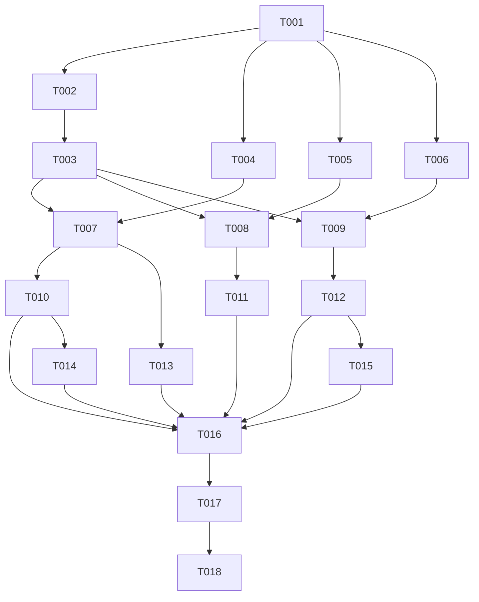

# Meridian BH Automation Suite — Implementation Tasks

## Summary
- **Total Tasks**: 18
- **Complexity**: 6 LOW, 9 MEDIUM, 3 HIGH
- **Parallel Groups**: 4 groups of parallelizable tasks
- **Layers**: Foundation (3) → Core (5) → Feature (6) → Integration (3) → Polish (1)

## Dependency Graph

## Tasks

### Foundation Layer
> No dependencies. Sets up project infrastructure.

---

#### T001: Scaffold Next.js + Convex project with dependencies
- **Layer**: FOUNDATION
- **Files**: `package.json`, `next.config.js`, `tailwind.config.ts`
- **Depends On**: None
- **Complexity**: MEDIUM

**Description**:
1. Initialize Next.js 14 project with App Router and TypeScript
2. Install dependencies: `convex`, `@anthropic-ai/sdk`, `resend`, `tailwindcss`, `@tailwindcss/typography`
3. Install shadcn/ui and initialize with default config
4. Install shadcn/ui components: button, card, badge, tabs, select, input, textarea, toast, separator
5. Create `.env.local` with placeholder keys: `CONVEX_DEPLOYMENT`, `NEXT_PUBLIC_CONVEX_URL`, `ANTHROPIC_API_KEY`, `RESEND_API_KEY`, `BRIEFING_EMAIL_TO`
6. Create `.gitignore` (node_modules, .next, .env.local, convex/_generated)
7. Set up Convex with `npx convex init` (or configure manually if project exists)
8. Create `src/app/globals.css` with Tailwind directives and a calming behavioral health color theme (slate blues, soft greens, white backgrounds)
9. Create `postcss.config.js`

**Validation**:
- [ ] `npm run dev` starts without errors
- [ ] `npx convex dev` connects to Convex backend
- [ ] Tailwind classes render correctly on a test page

**Invariants**: INV-010 (UTC timestamps — configured from the start)

---

#### T002: Define Convex database schema
- **Layer**: FOUNDATION
- **Files**: `convex/schema.ts`
- **Depends On**: T001
- **Complexity**: MEDIUM

**Description**:
Create the complete Convex schema with all 9 tables from PLAN.md data models:
- `clients`: name, status (validator: "active"|"inactive"|"discharged"), location, payerType, insuranceProvider, admitDate
- `appointments`: clientId (id reference), date, status (validator: "scheduled"|"completed"|"no_show"|"cancelled"), location, provider
- `revenue`: date, amount (number — cents), type (validator), clientId, claimId (optional)
- `insuranceClaims`: clientId, insuranceProvider, amount, dateSubmitted, datePaid (optional), status (validator)
- `referralSources`: name, organization, type (validator: "pcp"|"er"|"social_worker"|"school_counselor"|"therapist"|"other"), phone, email, lastReferralDate
- `referrals`: sourceId (id reference), patientName, dateReceived, currentStatus (validator: "received"|"contacted"|"scheduled"|"admitted"|"lost"), lostReason (optional validator), notes
- `referralStatusHistory`: referralId (id reference), status, changedAt
- `linkedinDrafts`: topic, content, status (validator: "draft"|"approved"|"rejected"), generatedAt, reviewedAt (optional)
- `briefings`: date, content, metrics (v.object with activeClients, noShows, weekRevenue, lastWeekRevenue, agingClaimsCount, agingClaimsAmount), emailSent, emailId (optional)

Define all indexes from PLAN.md:
- appointments: by_date, by_client
- revenue: by_date
- insuranceClaims: by_status
- referrals: by_source, by_status
- referralSources: by_type
- linkedinDrafts: by_status
- briefings: by_date

**Validation**:
- [ ] `npx convex dev` applies schema without errors
- [ ] All 9 tables visible in Convex dashboard

**Invariants**: INV-003 (referral status enum enforced), INV-006 (revenue as integer cents)

---

#### T003: Create and run seed data script
- **Layer**: FOUNDATION
- **Files**: `convex/seed.ts`
- **Depends On**: T002
- **Complexity**: HIGH

**Description**:
Create a Convex mutation (internalMutation) that seeds all demo data. Run it once via Convex dashboard or CLI.

Seed data:
1. **Clients** (50): Realistic names, mix of active (40), inactive (5), discharged (5). Split across "Main Campus" and "East Clinic". 60% insurance, 40% self-pay. Insurance providers: Blue Cross, Aetna, Cigna, UnitedHealthcare, Medicaid. Admit dates spread over last 6 months.

2. **Appointments** (200): Last 14 days of appointments. ~6 per weekday per location. Status distribution: 70% completed, 15% no-show, 10% scheduled (future), 5% cancelled. Provider names: 4 clinicians.

3. **Revenue** (150 entries): Last 28 days. This week's total ~$45,000, last week ~$42,000 (showing 7% growth). Mix of insurance_payment (avg $150), self_pay (avg $200), copay (avg $30).

4. **Insurance Claims** (35): Mix of statuses. ~8 aging past 30 days (submitted/pending with dateSubmitted > 30 days ago). Total aging amount ~$12,000.

5. **Referral Sources** (14): Named individuals at named organizations. Mix: 5 PCPs, 3 ERs, 3 social workers, 2 school counselors, 1 therapist. Include realistic org names (e.g., "Valley Primary Care", "St. Mary's ER", "Riverside School District").

6. **Referrals** (45): Spread across sources. Status distribution: 8 received, 10 contacted, 12 scheduled, 10 admitted, 5 lost. Some with stale dates (no change in 10+ days). 3 sources haven't sent referrals in 60+ days (cold sources).

7. **Referral Status History**: For each referral, create history entries showing progression through statuses with realistic timestamps.

8. **LinkedIn Drafts** (6): Pre-seeded with topics like "anxiety in teens", "importance of early intervention", "building referral partnerships". 2 approved, 2 draft, 2 rejected.

9. **Briefings** (5): Past 5 weekday briefings with realistic content and metrics snapshots. All marked emailSent: true.

**Validation**:
- [ ] Run seed mutation via Convex dashboard — no errors
- [ ] Clients table: 50 rows
- [ ] Appointments table: ~200 rows
- [ ] Revenue table: ~150 rows
- [ ] InsuranceClaims table: 35 rows, 8 aging past 30 days
- [ ] ReferralSources: 14 rows across all types
- [ ] Referrals: 45 rows, stale referrals exist, cold sources exist
- [ ] LinkedinDrafts: 6 rows
- [ ] Briefings: 5 rows

**Invariants**: INV-001 (all data is fake), INV-003 (valid status values), INV-004 (status history preserved), INV-006 (revenue in cents)

---

### Core Layer
> Depends on Foundation. Implements data access and business logic.

---

#### T004: Create utility libraries (Claude prompts, Resend, formatters)
- **Layer**: CORE
- **Files**: `lib/claude.ts`, `lib/resend.ts`, `lib/utils.ts`
- **Depends On**: T001
- **Complexity**: MEDIUM

**Description**:
1. `lib/claude.ts`:
   - Export `BRIEFING_SYSTEM_PROMPT`, `LINKEDIN_SYSTEM_PROMPT`, `PIPELINE_SYSTEM_PROMPT` as string constants (from PLAN.md prompt strategy)
   - Export `buildBriefingUserPrompt(metrics)` — formats metrics data into structured prompt
   - Export `buildLinkedinUserPrompt(topic)` — formats topic into prompt
   - Export `buildPipelineUserPrompt(data)` — formats referral data into prompt
   - Export `callClaude(systemPrompt, userPrompt)` — wrapper that creates Anthropic client, calls messages.create with claude-sonnet-4-20250514, returns text content. Handles errors with try/catch.

2. `lib/resend.ts`:
   - Export `sendBriefingEmail(to, subject, htmlContent)` — creates Resend client, sends email with from address "Meridian BH <briefings@meridian-bh.com>" (or configured sender), returns message ID or null on failure

3. `lib/utils.ts`:
   - Export `formatCurrency(cents: number)` — converts cents to "$X,XXX.XX" format
   - Export `formatDate(timestamp: number)` — formats Unix ms to "Mar 27, 2026" display
   - Export `formatDateTime(timestamp: number)` — formats to "Mar 27, 2026 9:00 AM"
   - Export `daysAgo(timestamp: number)` — returns number of days between timestamp and now
   - Export `cn(...classes)` — Tailwind class merge utility (clsx + tailwind-merge)

**Validation**:
- [ ] All exports type-check without errors
- [ ] `formatCurrency(4500)` returns "$45.00"
- [ ] `formatCurrency(4523150)` returns "$45,231.50"

**Invariants**: INV-002 (prompts never request PHI), INV-005 (LinkedIn prompt explicitly prohibits patient info), INV-006 (currency formatting)

---

#### T005: Create all Convex queries
- **Layer**: CORE
- **Files**: `convex/queries/dashboard.ts`, `convex/queries/briefings.ts`, `convex/queries/referrals.ts`
- **Depends On**: T001, T002 (schema must exist)
- **Complexity**: HIGH

**Description**:
1. `convex/queries/dashboard.ts`:
   - `getMetrics` query: Count active clients, count today's appointments, sum this week's revenue (Mon-Sun), sum last week's revenue, count + sum aging claims (submitted/pending older than 30 days). Return typed object.

2. `convex/queries/briefings.ts`:
   - `getLatest` query: Return most recent briefing by date
   - `list` query: Return last 30 days of briefings, sorted by date desc

3. `convex/queries/referrals.ts`:
   - `list` query: Return all referrals joined with source name/org, sorted by dateReceived desc
   - `getStale` query: Return referrals where currentStatus is not "admitted"/"lost" AND last status change was 7+ days ago (use referralStatusHistory or approximate with daysAgo on dateReceived)
   - `getSourceLeaderboard` query: Aggregate referral count per source for last 90 days, sorted by count desc. Include source details and lastReferralDate.
   - `getColdSources` query: Return sources where lastReferralDate is 60+ days ago or null

**Validation**:
- [ ] Each query returns data from seeded database
- [ ] `getMetrics` returns all expected fields with correct types
- [ ] `getStale` returns referrals with status change > 7 days ago
- [ ] `getColdSources` returns sources with no recent referrals

**Invariants**: INV-007 (stale threshold = 7 days), INV-008 (cold threshold = 60 days)

---

#### T006: Create LinkedIn draft query
- **Layer**: CORE
- **Files**: `convex/queries/linkedin.ts`
- **Depends On**: T001, T002
- **Complexity**: LOW

**Description**:
- `listDrafts` query: Accept optional status filter. Return all LinkedIn drafts sorted by generatedAt desc. If status provided, filter by it.

**Validation**:
- [ ] Returns seeded drafts
- [ ] Filtering by status works (draft, approved, rejected)

---

#### T007: Create Convex mutations for briefings and referrals
- **Layer**: CORE
- **Files**: `convex/mutations/briefings.ts`, `convex/mutations/referrals.ts`
- **Depends On**: T002, T003 (needs schema + seed data to test against)
- **Complexity**: MEDIUM

**Description**:
1. `convex/mutations/briefings.ts`:
   - `store` internalMutation: Insert briefing with content, metrics object, emailSent boolean, optional emailId. Set date to current timestamp.

2. `convex/mutations/referrals.ts`:
   - `updateStatus` mutation: Accept referralId, new status, optional lostReason. Validate status is in allowed set. Update referrals.currentStatus. Insert new row into referralStatusHistory with changedAt = now. If new status is "admitted", update the source's lastReferralDate.

**Validation**:
- [ ] `store` creates a new briefing row
- [ ] `updateStatus` changes referral status AND creates history entry
- [ ] `updateStatus` with "admitted" updates source's lastReferralDate
- [ ] `updateStatus` with "lost" stores lostReason

**Invariants**: INV-003 (status enum enforced), INV-004 (history is append-only)

---

#### T008: Create Convex mutations for LinkedIn drafts
- **Layer**: CORE
- **Files**: `convex/mutations/linkedin.ts`
- **Depends On**: T002, T003
- **Complexity**: LOW

**Description**:
- `storeDraft` internalMutation: Insert new draft with topic, content, status "draft", generatedAt = now
- `updateDraftStatus` mutation: Accept draftId and new status ("approved"|"rejected"). Update status and set reviewedAt = now.

**Validation**:
- [ ] `storeDraft` creates a new draft with status "draft"
- [ ] `updateDraftStatus` changes status and sets reviewedAt

---

### Feature Layer
> Depends on Core. Implements user-facing capabilities and bot actions.

---

#### T009: Create Claude API actions (briefing, LinkedIn, pipeline)
- **Layer**: FEATURE
- **Files**: `convex/actions/generateBriefing.ts`, `convex/actions/generateLinkedinDraft.ts`, `convex/actions/generatePipelineInsights.ts`
- **Depends On**: T004 (claude.ts), T005 (queries), T007 (mutations), T008 (mutations)
- **Complexity**: HIGH

**Description**:
All three files use `"use node"` directive at top.

1. `convex/actions/generateBriefing.ts`:
   - Export `generateBriefing` as action (no args — triggered by cron)
   - Run `ctx.runQuery(api.queries.dashboard.getMetrics)` to get all metrics
   - Build prompt using `buildBriefingUserPrompt(metrics)`
   - Call `callClaude(BRIEFING_SYSTEM_PROMPT, userPrompt)`
   - Format briefing as HTML email
   - Call `sendBriefingEmail()` with the content
   - Call `ctx.runMutation(internal.mutations.briefings.store, { content, metrics, emailSent, emailId })`
   - **Fallback**: If Claude API fails, format raw metrics into a basic table email and send that instead. Always store the briefing.

2. `convex/actions/generateLinkedinDraft.ts`:
   - Export `generateLinkedinDraft` as action, accepts `{ topic: string }`
   - Build prompt using `buildLinkedinUserPrompt(topic)`
   - Call `callClaude(LINKEDIN_SYSTEM_PROMPT, userPrompt)`
   - Call `ctx.runMutation(internal.mutations.linkedin.storeDraft, { topic, content })`
   - Return the generated content for immediate UI display

3. `convex/actions/generatePipelineInsights.ts`:
   - Export `generatePipelineInsights` as action (no args)
   - Run queries to get referral data, source leaderboard, stale referrals, cold sources
   - Build prompt using `buildPipelineUserPrompt(data)`
   - Call Claude, return insights text

**Validation**:
- [ ] `generateBriefing` runs without error, stores briefing, sends email (check Resend logs)
- [ ] `generateLinkedinDraft` with topic "anxiety in teens" returns a 150-300 word post
- [ ] `generatePipelineInsights` returns actionable insights text
- [ ] Briefing fallback works when Claude API key is invalid

**Invariants**: INV-002 (no PHI in prompts), INV-005 (no patient info in LinkedIn), INV-009 (briefing always completes)

---

#### T010: Create cron job for morning briefing
- **Layer**: FEATURE
- **Files**: `convex/crons.ts`
- **Depends On**: T009
- **Complexity**: LOW

**Description**:
Define Convex cron job:
- Schedule `generateBriefing` action to run daily. Use a cron expression for 7:00 AM ET (12:00 UTC, or `"0 12 * * *"` — adjust for DST as needed).
- Note: For demo purposes, also export the action so it can be triggered manually from the dashboard.

**Validation**:
- [ ] Cron definition deploys without error
- [ ] Cron shows in Convex dashboard under scheduled functions

---

#### T011: Build dashboard layout and briefing section
- **Layer**: FEATURE
- **Files**: `src/app/layout.tsx`, `src/app/page.tsx`, `src/app/components/dashboard-header.tsx`
- **Depends On**: T001, T005
- **Complexity**: MEDIUM

**Description**:
1. `src/app/layout.tsx`:
   - Wrap app in `ConvexProvider` with `ConvexReactClient`
   - Set metadata: title "Meridian Behavioral Health — Dashboard"
   - Import globals.css, Inter font

2. `src/app/page.tsx`:
   - Use shadcn Tabs component with 3 tabs: "Intelligence Briefing", "LinkedIn Drafts", "Referral Pipeline"
   - Import and render DashboardHeader above tabs
   - Import and render each section component in its tab panel
   - Mark as `"use client"`

3. `src/app/components/dashboard-header.tsx`:
   - Display "Meridian Behavioral Health" with a clean logo/wordmark
   - Use `useQuery(api.queries.dashboard.getMetrics)` to show 4 metric cards:
     - Active Clients (number)
     - Today's Appointments (number)
     - This Week Revenue (formatted currency)
     - Aging Claims (count, with dollar amount)
   - Use shadcn Card components for each metric
   - Week-over-week revenue change shown as green up arrow or red down arrow with percentage

**Validation**:
- [ ] Dashboard renders at localhost:3000
- [ ] All 4 metric cards display data from Convex
- [ ] Tabs switch between sections
- [ ] "Meridian Behavioral Health" branding visible

---

#### T012: Build briefing section components
- **Layer**: FEATURE
- **Files**: `src/app/components/briefing-section.tsx`, `src/app/components/briefing-card.tsx`
- **Depends On**: T005, T011
- **Complexity**: MEDIUM

**Description**:
1. `src/app/components/briefing-section.tsx`:
   - Use `useQuery(api.queries.briefings.getLatest)` for featured briefing
   - Use `useQuery(api.queries.briefings.list)` for history
   - "Generate Now" button that triggers `generateBriefing` action manually (for demo)
   - Show loading state while generating
   - Display latest briefing prominently, history below in cards

2. `src/app/components/briefing-card.tsx`:
   - Display briefing date, content (rendered as formatted text), metrics summary
   - Email sent indicator (green checkmark if emailSent true)
   - Clean card layout with shadcn Card

**Validation**:
- [ ] Latest briefing displays with formatted content
- [ ] Briefing history shows past 5 briefings
- [ ] "Generate Now" triggers briefing generation and new briefing appears
- [ ] Email sent indicator shows correctly

---

#### T013: Build LinkedIn drafts section components
- **Layer**: FEATURE
- **Files**: `src/app/components/linkedin-section.tsx`, `src/app/components/linkedin-form.tsx`, `src/app/components/linkedin-card.tsx`
- **Depends On**: T006, T008, T009, T011
- **Complexity**: MEDIUM

**Description**:
1. `src/app/components/linkedin-section.tsx`:
   - Use `useQuery(api.queries.linkedin.listDrafts)` for all drafts
   - Render LinkedinForm at top
   - Filter tabs: All, Drafts, Approved, Rejected
   - Render LinkedinCard for each draft

2. `src/app/components/linkedin-form.tsx`:
   - Text input for topic
   - "Generate Draft" button
   - Use `useAction(api.actions.generateLinkedinDraft)` on submit
   - Show loading spinner during generation
   - Clear input on success
   - Validate: topic required, max 500 chars

3. `src/app/components/linkedin-card.tsx`:
   - Display topic, generated content, status badge (color-coded: blue=draft, green=approved, red=rejected)
   - "Approve" and "Reject" buttons (only show when status is "draft")
   - Use `useMutation(api.mutations.linkedin.updateDraftStatus)` for status changes
   - Show generated date and reviewed date (if exists)

**Validation**:
- [ ] Topic input + generate produces a new draft card
- [ ] Draft appears immediately after generation
- [ ] Approve/reject buttons work, badge updates in real-time
- [ ] Filter tabs filter correctly

**Invariants**: INV-005 (no patient info in drafts)

---

#### T014: Build referral pipeline section — table and status updates
- **Layer**: FEATURE
- **Files**: `src/app/components/pipeline-section.tsx`, `src/app/components/referral-table.tsx`
- **Depends On**: T005, T007, T011
- **Complexity**: MEDIUM

**Description**:
1. `src/app/components/pipeline-section.tsx`:
   - Three sub-sections: Alerts (top), Referral Table (middle), Source Leaderboard (bottom)
   - Import and compose StaleAlerts, ReferralTable, SourceLeaderboard
   - "Generate Pipeline Insights" button that calls the action and displays results in a modal or expandable card

2. `src/app/components/referral-table.tsx`:
   - Use `useQuery(api.queries.referrals.list)` for data
   - Table columns: Patient Name, Source, Organization, Date Received, Days in Pipeline, Status, Actions
   - Status column: shadcn Select dropdown to change status
   - On status change to "lost", show a secondary dropdown for lostReason
   - Stale referrals (7+ days) highlighted with yellow/amber background row
   - Use `useMutation(api.mutations.referrals.updateStatus)` on dropdown change

**Validation**:
- [ ] Referral table displays all 45 seeded referrals
- [ ] Status dropdown changes persist to database
- [ ] Stale referrals are visually highlighted
- [ ] "Lost" status shows reason dropdown

**Invariants**: INV-003 (valid statuses only), INV-004 (history preserved on change), INV-007 (stale = 7 days)

---

#### T015: Build referral source leaderboard and stale alerts
- **Layer**: FEATURE
- **Files**: `src/app/components/source-leaderboard.tsx`, `src/app/components/stale-alerts.tsx`
- **Depends On**: T005, T011
- **Complexity**: MEDIUM

**Description**:
1. `src/app/components/source-leaderboard.tsx`:
   - Use `useQuery(api.queries.referrals.getSourceLeaderboard, { days: 90 })` for data
   - Ranked list showing: rank number, source name, organization, type badge, referral count, last referral date
   - Cold sources (60+ days) shown with red alert icon
   - Clean card layout, professional look

2. `src/app/components/stale-alerts.tsx`:
   - Use `useQuery(api.queries.referrals.getStale)` for stale referrals
   - Use `useQuery(api.queries.referrals.getColdSources)` for cold sources
   - Alert cards:
     - "X referrals need follow-up" with list of stale referral names + days stale
     - "X sources have gone cold" with list of cold sources + days since last referral
   - If no stale/cold: show green "All referrals active / All sources active" message

**Validation**:
- [ ] Leaderboard shows sources ranked by volume
- [ ] Cold sources marked with alert icon
- [ ] Stale alerts show correct count of overdue referrals
- [ ] When no stale referrals exist, positive message shows

**Invariants**: INV-007 (7-day threshold), INV-008 (60-day threshold)

---

### Integration Layer
> Cross-feature verification and end-to-end flows.

---

#### T016: Wire all sections together and verify end-to-end dashboard
- **Layer**: INTEGRATION
- **Files**: `src/app/page.tsx` (update if needed)
- **Depends On**: T011, T012, T013, T014, T015
- **Complexity**: LOW

**Description**:
1. Verify all three tab sections render correctly with real Convex data
2. Verify tab switching is smooth (no flicker, no data loss)
3. Verify real-time updates: change a referral status and see it update in table, alerts, and leaderboard
4. Verify briefing generation: click "Generate Now", watch briefing appear in real-time
5. Verify LinkedIn flow: enter topic → generate → approve, all reflected in real-time
6. Fix any component integration issues (prop types, import paths, layout spacing)

**Validation**:
- [ ] All three tabs display data correctly
- [ ] Real-time updates work across all sections
- [ ] No console errors in browser
- [ ] No TypeScript errors in build

---

#### T017: Visual polish and demo-readiness
- **Layer**: INTEGRATION
- **Files**: `src/app/globals.css`, `tailwind.config.ts` (update)
- **Depends On**: T016
- **Complexity**: MEDIUM

**Description**:
1. Refine color theme: calming behavioral health palette (slate blues, sage greens, warm neutrals)
2. Ensure consistent spacing, typography, and component sizing across all sections
3. Add subtle transitions/animations for tab switches and data updates
4. Ensure the dashboard looks polished at 1920x1080 (demo recording resolution)
5. Add empty state messages for each section (per SPEC.md edge cases)
6. Add loading states (skeleton loaders) for each query
7. Add error toasts for failed actions (per SPEC.md error states)

**Validation**:
- [ ] Dashboard looks professional at 1920x1080
- [ ] No visual inconsistencies or spacing issues
- [ ] Loading states show briefly then resolve
- [ ] Error states display correctly when API calls fail

---

#### T018: Final verification and demo walkthrough
- **Layer**: INTEGRATION
- **Files**: None (verification only)
- **Depends On**: T017
- **Complexity**: LOW

**Description**:
Walk through every user journey from SPEC.md in the running application:

1. **J1 — Morning Briefing**: Click "Generate Now" → verify briefing appears → check email delivery in Resend dashboard → verify briefing in history list
2. **J2 — LinkedIn Draft**: Enter "anxiety in teens" → click Generate → verify draft appears → approve draft → verify status change → enter new topic → generate another → reject it
3. **J3 — Referral Pipeline**: View table → find a stale referral → change its status → verify history updated → check source leaderboard → identify cold source → verify alerts section

Verify each invariant in the running app:
- INV-001: All data is obviously fake names/orgs
- INV-003: Try to set an invalid status (should be impossible via UI dropdowns)
- INV-005: Read LinkedIn drafts — no patient info
- INV-006: Revenue displays as "$XX,XXX.XX"
- INV-009: Briefing generation completes even if content varies

**Validation**:
- [ ] All 3 user journeys complete successfully
- [ ] All 10 invariants verified in running app
- [ ] Dashboard ready for demo video recording

---

## Execution Order

### Phase 1: Foundation
T001 (scaffold project)

### Phase 2: Foundation (Parallel after T001)
Execute simultaneously: T002 (schema), T004 (utilities)

### Phase 3: Foundation
T003 (seed data) — requires T002

### Phase 4: Core (Parallel)
Execute simultaneously: T005 (queries), T006 (LinkedIn query), T007 (briefing + referral mutations), T008 (LinkedIn mutations)
— all require T002/T003

### Phase 5: Feature (Parallel)
Execute simultaneously: T009 (Claude actions), T010 (cron), T011 (dashboard layout)
— T009 requires T004+T005+T007+T008, T010 requires T009, T011 requires T001+T005

### Phase 6: Feature (Parallel)
Execute simultaneously: T012 (briefing UI), T013 (LinkedIn UI), T014 (referral table), T015 (leaderboard + alerts)
— all require T011

### Phase 7: Integration
T016 (wire together) → T017 (polish) → T018 (final verification)

## Post-Implementation Checklist

### Spec Cross-Check
- [ ] C1: Daily BI Briefing Bot — generates briefing, sends email, stores in DB
- [ ] C2: LinkedIn Drafting Bot — generates from topic, approve/reject workflow
- [ ] C3: Referral Pipeline Bot — status tracking, stale alerts, cold sources, leaderboard
- [ ] C4: Dashboard — 3 tabs, branding, real-time data, clean UI

### Invariant Verification
- [ ] INV-001: No real patient data — all names are obviously fake
- [ ] INV-002: Claude prompts contain only aggregated metrics, no PHI
- [ ] INV-003: Referral status restricted to enum set
- [ ] INV-004: Status history is append-only (check referralStatusHistory table)
- [ ] INV-005: LinkedIn drafts contain no patient info
- [ ] INV-006: Revenue displayed as formatted currency
- [ ] INV-007: Stale threshold = 7 days (configurable)
- [ ] INV-008: Cold source threshold = 60 days (configurable)
- [ ] INV-009: Briefing always completes (test with invalid API key)
- [ ] INV-010: Timestamps display in local timezone

### Quality Gates
- [ ] `npm run build` succeeds
- [ ] `npx convex deploy` succeeds (or dev mode works)
- [ ] No TypeScript errors
- [ ] No console errors in browser
- [ ] No hardcoded API keys in codebase
- [ ] All 37 touchpoints from PLAN.md created
- [ ] All 6 effects from PLAN.md implemented
